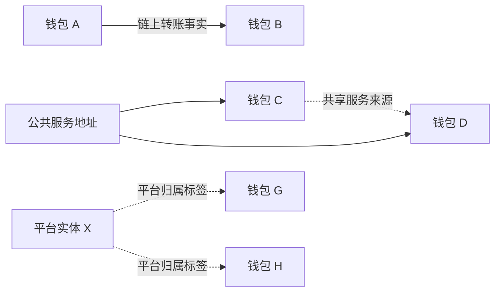

## 1. 范围与主要结论

本文件整理十类常见链上分析产品，重点回答：在哪里查看钱包关系、页面展示什么、指标如何定义、公开的检测方法是什么，以及有哪些可查看的例子。资料核查日期为 **2026 年 9 月 12 日**。

钱包“有关联”至少有四种含义：存在转账、共享交易对手、具有行为相关性、被归属到同一实体。它们的证据强度不同。**一条图连线通常不是共同所有权证明，一个风险分数也不是地址关联图。**

主要结论如下：

- **看地址之间的线索**：Bubblemaps、Arkham Visualizer / Tracer、Nansen Profiler 最直接；Etherscan 也提供 Token Flow Visualizer。
- **看某一群地址占多少供应量**：GeckoTerminal、CoinMarketCap、GMGN、Birdeye 提供相关持仓、分组或标签数据，但定义不完全相同。
- **看合约权限与开发者持仓**：GoPlus 等安全产品提供结构化证据，但不应被当成全面的共同控制识别器。
- **看交易与行情，再回查地址**：DEX Screener 是有用的市场观察入口；其公开行情 API 不等于钱包归属算法。

全文分别标注“官方定义”“官方历史案例”“页面核实”“说明性示例”。官方描述不代表内部算法完整公开；本文件不将某个页面显示的标签当成独立证实的现实身份。

## 2. 工具与页面入口总表

| 工具 | 可打开的产品入口 | 关联展示的主要形式 | 最适合回答的问题 |
| --- | --- | --- | --- |
| Bubblemaps V2 | [v2.bubblemaps.io](https://v2.bubblemaps.io/) | 气泡图、转账线、集群、间接节点与时间节点 | 大持仓地址之间有什么联系？ |
| Arkham | [Visualizer](https://arkm.com/visualizer)、[Tracer](https://arkm.com/tracer) | 地址/实体关系图、资金路径、标签 | 钱往哪里流？多个地址被平台归到谁？ |
| Nansen | [app.nansen.ai](https://app.nansen.ai/) | Profiler、钱包对比、关联钱包与交易对手表 | 哪些地址与这个钱包有互动或被列为关联？ |
| GeckoTerminal | [geckoterminal.com](https://www.geckoterminal.com/) | 持仓、风险指标、图表、集成关系图 | 持仓是否集中？相关群体占比及风险是什么？ |
| CoinMarketCap / DexScan | [dex.coinmarketcap.com/token/all](https://dex.coinmarketcap.com/token/all/) | 持仓/交易者信息、标签、趋势 | 某些标签群体如何持仓和交易？ |
| GMGN | [gmgn.ai](https://gmgn.ai/) | 交易及持仓标签、Bundler 筛选、集成气泡图 | 早期交易群体有哪些共同特征？ |
| Birdeye | [birdeye.so](https://birdeye.so/) | 持仓画像、标签分组、钱包明细与资金来源 API | 相关标签群体持有多少、具体是谁？ |
| Etherscan | [Token 页面示例](https://etherscan.io/token/0x95ad61b0a150d79219dcf64e1e6cc01f0b64c4ce)、[Advanced Filter](https://etherscan.io/advanced-filter) | Token Flow Visualizer、交易/转账表、地址分析 | 图上的关系能否追溯到具体链上事件？ |
| DEX Screener | [dexscreener.com](https://dexscreener.com/) | 池成交、交易地址、价格及流动性 | 哪些地址在池中交易？何时、多少？ |
| GoPlus | [Token Security 示例入口](https://console.gopluslabs.io/token-security/1/0x95ad61b0a150d79219dcf64e1e6cc01f0b64c4ce) | 合约、owner/creator、持仓及 LP 风险字段 | 开发者或权限地址持有什么、能做什么？ |

入口可访问不等于全部功能可用。动态页面、登录、订阅、链覆盖和刷新状态都会影响结果。文末另列本次实例核实情况；未加载的图没有被当成完整实时样本。

## 3. Bubblemaps：持仓关系图

### 3.1 页面与展示

官方说明：[How does it work?](https://wiki.bubblemaps.io/bubblemaps-v2/how-does-it-work)。[^1]

默认视图以主要持币地址为节点，气泡大小体现持仓，连接体现转账关系。点击节点可以查看地址及持仓；查看转入/转出记录可定位关系中的资产和交易时间。历史视图与当前图应分别理解。

| 页面元素 | 表达什么 | 不直接表达什么 |
| --- | --- | --- |
| 气泡大小 / 持仓数量 | 地址在所选代币中的仓位 | 地址在其他代币中的财富 |
| Supply % | 地址或指定集群的供应占比 | 团队最终受益权占比 |
| 转账连线 | 地址间存在被纳入当前视图的转账 | 两个地址一定属于同一人 |
| 集群 | 在当前图规则下连接的一组节点 | 全部成员共同控制的法律或事实证明 |
| 节点类型与标签 | 持币地址、合约、服务地址等上下文 | 每个标签都经过同等强度验证 |

视图会受节点范围、过滤条件和数据更新时间影响。高活跃服务节点可能产生大量关系；官方有专门的显示处理。**没有画出线，不等于历史上没有联系。**

### 3.2 公开方法

**基础图：**持仓记录确定观察对象，转账数据确定连接。V2 的连接不局限于正在研究的那一种代币；部分关系可能涉及跨链。[^1]

**Magic Nodes：**加入不在当前主要持币列表中的中间地址，帮助展示间接资金联系。这里新增的节点可能当前不持有目标币。[^2]

**Time Nodes：**用时间维度组织互动，显示时间上协调的地址关系。它与单纯的地址转账边不同；具体产品实现、完整判定参数及所有链的覆盖不能从公开概述完整还原。[^3]

### 3.3 可查看的示例

**官方历史案例：SHIB 的 Magic Nodes 对比。**官方教程提供两张可分享图：

- [SHIB：默认关系图](https://v2.bubblemaps.io/map/PWljIpdYB8TZuUfaDSwT)
- [SHIB：加入 Magic Nodes 的关系图](https://v2.bubblemaps.io/map/LSxRoiNVWvIanZJdFyTS)
- [案例原文及配图](https://wiki.bubblemaps.io/bubblemaps-v2/magic-nodes)

教程展示：加入非持币中间地址后，原来不明显的资金路径可以连起来。这证明默认持币图与扩展关系图观察范围不同，不能据此直接断言所有节点同属一个控制者。[^2]

**实际访问状态：**默认案例链接在本次浏览器访问中重定向为 [SHIB 当前查询入口](https://v2.bubblemaps.io/map?address=0x95ad61b0a150d79219dcf64e1e6cc01f0b64c4ce&chain=eth)，随后页面显示加载错误。因此案例结论来自官方历史教程，未将历史百分比或图结构当作当前值。

**时间关系案例：**[Time Nodes 官方页面](https://wiki.bubblemaps.io/bubblemaps-v2/time-nodes)附有 BULLISH、OVPP 图示，分别说明服务节点的时间关系和早期交易协调线索。本文件将其视为供应商案例，不独立确认项目方身份。[^3]

## 4. Arkham：从地址关系到实体归属

### 4.1 页面 URL

- 关系图：[arkm.com/visualizer](https://arkm.com/visualizer)
- 路径追踪：[arkm.com/tracer](https://arkm.com/tracer)
- 官方实体示例：[BlackRock entity](https://arkm.com/explorer/entity/blackrock)
- 功能与页面说明：[How To Use Arkham Intel](https://info.arkm.com/research/how-to-use-arkham-intel-guide-explained)。[^4]

### 4.2 展示与公开方法

Visualizer 展示地址或实体之间的资金关系；Tracer 更强调资金沿地址顺序流动的路径。交易明细可以提供资产、金额和时间依据，实体视图则把平台归属到同一主体的地址汇总。[^4]

Arkham 将元数据区分为三层：**Entity 是主体集合，Label 是具体地址名称，Tag 是行为或属性说明**。其公开方法概述包含链上聚类、机器学习、链下公开资料、内部研究和社区情报。完整模型、权重和每个实体的全部证据未公开。[^4]

| 需要区分的结果 | 含义 |
| --- | --- |
| 交易关系图 | A 与 B 之间出现资金流 |
| 已验证实体标签 | Arkham 按其证据标准作出的高置信归属 |
| Entity Prediction | 平台明确区分的较低置信预测 |
| Custom Entity / Label | 用户创建或修改的归类，不应视为 Arkham 自动认定 |

平台专门说明过预测标签与已验证标签不同，也调整过自定义标签的展示以避免误解。[^5][^6]

### 4.3 示例如何阅读

BlackRock 页面是**平台实体归类示例**，不是本文件独立审计的地址清单。阅读时应分别检查：实体包含的地址、地址具体标签、实体对外资金流，以及标签的证据类型。不要把“向该实体转过账”理解成“属于该实体”。

旧的 `intel.arkm.com` Visualizer、Tracer 和该实体链接在本次访问中重定向到 `arkm.com`。入口已核实，完整交互式资金图未在本次逐节点审计。

## 5. Nansen：关联钱包、交易对手与钱包对比

### 5.1 页面与功能入口

产品入口：[app.nansen.ai](https://app.nansen.ai/)。官方 [Nansen Profiler 101](https://academy.nansen.ai/help/articles/0002013-nansen-profiler-101)介绍三个功能：地址 Profiler、Wallet Profiler for Token、Wallet Pair Profiler。最后一种用于同时查看两个地址的直接交易、共享交易对手和网络关系。具体页面可能需要登录。[^7]

### 5.2 可核实的指标与接口

| 功能 / 文档 URL | 主要字段 | 解释 |
| --- | --- | --- |
| [Address Related Wallets](https://docs.nansen.ai/api/profiler/address-related-wallets) | 地址、标签、`relation`、交易哈希、时间、链 | 返回具体关系记录，不只是一个相似度分数 |
| [Address Counterparties](https://docs.nansen.ai/api/profiler/address-counterparties) | 互动次数、总额、流入、流出、代币明细 | 按地址或实体观察互动规模与方向 |
| [Address First Funder](https://docs.nansen.ai/api/profiler/address-first-funder) | 首个资助地址、标签、交易哈希、时间、链 | 当前公开定义是 EVM 钱包最早收到原生 Gas 资产的资助来源 |

Related Wallets 文档提供当前关系视图，不提供任意历史时间范围查询；关系类型字段存在，但不能据此推断所有内部分类逻辑已公开。[^8]

Counterparties 是对互动数据的统计，可以按钱包或实体聚合。**交易对手是交互对象，不是同伙或同一控制者的同义词。**[^9]

First Funder 的资产口径尤其重要：原生 Gas 资产的首次来源，不必然是钱包 USDC 或全部资金的来源。该接口对地址和链有明确范围，不能泛化为所有链、所有资产的完整资金溯源。[^10]

### 5.3 示例

官方 Counterparties 文档以公开地址 `0x28c6c06298d514db089934071355e5743bf21d60` 和 Coinbase 实体为参数示例，说明“单地址对手”和“实体汇总对手”的差别。可在[示例所在文档](https://docs.nansen.ai/api/profiler/address-counterparties)查看字段及示例。这里没有把文档请求示例伪装成已取得的实时 API 结果。[^9]

## 6. GeckoTerminal / CoinGecko：集群持仓指标与安全评分

### 6.1 页面 URL 与实查例子

- 产品：[geckoterminal.com](https://www.geckoterminal.com/)
- 具体池：[Ethereum WETH / USDC，Uniswap V3](https://www.geckoterminal.com/eth/pools/0x88e6a0c2ddd26feeb64f039a2c41296fcb3f5640)
- 使用说明：[How to Use GeckoTerminal](https://www.coingecko.com/learn/geckoterminal)。[^11]

该池页面本次已在浏览器打开，确认有价格、成交笔数、买卖计数、成交量、流动性、Holders、GT Security Score 和安全工具跳转入口。这是**行情与安全信息的页面实例**，不是证明该池存在异常关联的案例，也不证明所有链都显示相同关联字段。

### 6.2 与钱包关联直接相关的指标

| 指标 | 官方描述的观察对象 | 阅读重点 |
| --- | --- | --- |
| Top 10 Holders % | 十个主要钱包的供应占比，说明中排除已知池持仓 | 地址集中度不等于实体集中度 |
| Developer Holding % | 被识别为开发者/部署者相关的钱包持仓 | 取决于识别覆盖，不代表完整团队经济权益 |
| Clusters Holding % | 被联系起来的地址群持有的供应占比 | 需回看群内地址及关系依据 |
| Early Buyers Holding % | 被标记的早期买入群体持仓 | 属于群体标签，不直接证明与发行方同属一方 |

官方指标页提到转账与共同资金来源等关联线索；没有公布完整聚类算法。合约 mint/freeze、买卖限制和 LP 状态则属于另外的风险维度。[^12]

### 6.3 两个不应混淆的检测功能

**GT Security Score：**结合市场活动与安全/供应信息；官方明确不公布精确权重或阈值，且数据覆盖因链而异。它不是钱包归属概率。[^13]

**Suspicious chart detection：**官方描述为分析周期 K 线和成交量中的异常模式，并标明 beta。这是市场行为异常检查，不是地址间转账边的定义。[^14]

**说明性示例：**一个代币 Top 10 较低，但关联群体的总持仓较高，两项并不矛盾：前者数单地址，后者数满足某种关系规则的群体。判断前要对齐供应量分母、地址排除规则和数据时间。

## 7. CoinMarketCap / DexScan：持仓标签与地址活动

### 7.1 页面 URL

- 旧入口：[coinmarketcap.com/dexscan](https://coinmarketcap.com/dexscan/)
- 本次重定向后的入口：[dex.coinmarketcap.com/token/all](https://dex.coinmarketcap.com/token/all/)
- 字段文档：[Holder API Documentation](https://pro.coinmarketcap.com/api/documentation/pro-api-reference/holder)。[^15]

### 7.2 公开指标

| 数据组 | 文档中的代表字段 | 可回答的问题 |
| --- | --- | --- |
| 持仓 | `walletAddress`、`balance`、`percent`、`totalSupply` | 谁持有多少？ |
| 地址标签 | `tags`，dev、bot、sniper、whale 等标签筛选 | 哪些地址被平台标记为某类参与者？ |
| 来源与活动 | `fundingSource`、`fundingTime`、`firstActiveTime`、`lastActiveTime` | 平台记录的来源和活动时点是什么？ |
| 交易画像 | 买卖次数、买卖额、净买入、持仓与 PnL 字段 | 某地址的交易和仓位怎样变化？ |
| 群体变化 | holder count、trend、tag count 接口 | 持币数量或标签分组如何变化？ |

字段说明证明产品提供这些数据对象，但没有完整公开 dev/bot/sniper 的判定公式。文档里的 `walletCreateTime` 也不能直接解释为 EOA 私钥离线生成的真实时间。[^15]

### 7.3 示例与边界

官方 Holder 文档提供请求及返回结构示例，可看到“一个持仓地址记录同时携带来源、标签和买卖信息”的形式。示例中的占位值不是实际代币检测结果。本次核实了 DexScan 入口及公开接口文档，未声称某个具体代币的全部标签已实测。

**说明性示例：**标签表出现多个 `dev` 或 `bot` 地址，是平台分类结果；如果要判断它们是否相互转账，还需要交易明细或关系图。不能仅因为标签相同就合并成同一实体。

## 8. GMGN：早期交易标签与集成气泡图

### 8.1 页面 URL

- 产品：[gmgn.ai](https://gmgn.ai/)
- 指标和页面示例：[What Is a Meme Coin Bundle?](https://gmgn.ai/blog/what-is-a-meme-coin-bundle/)
- 标签图例：[Featured Icon Definition](https://docs.gmgn.ai/index/featured-icon-definition)。[^16][^17]

### 8.2 展示方式与公开方法

官方指南描述：Trenches 显示相关指标；代币详情中的 Trades 可按 Bundler 筛选；地址带有 DEV、Sniper、Insider 等标签；关联图入口可以使用 InsightX、Bubblemaps、Faster100X 等来源，具体随链和页面变化。**GMGN 展示的关系图不一定由 GMGN 自己计算。**[^16]

| 项目 | 公开含义 | 需要注意 |
| --- | --- | --- |
| Bundle % | 官方指南描述为捆绑买入贡献的交易量比例 | 不等于这些钱包当前持有的供应比例 |
| Bundler 钱包 | 被产品判为参与捆绑交易的地址 | 不自动等于发行方钱包 |
| Sniper | 早期买入行为标签 | 早买与共同控制是不同问题 |
| Suspected Insider | 基于来源、时序等相似特征的疑似关联标签 | 名称中的“疑似”不能省略 |
| 气泡图 | 由当前集成供应商定义的关联可视化 | 同一名称的线或节点需看供应商解释 |

公开资料给出标签概念和展示方式，但没有完整公开统一的 Insider 模型。[^17]

### 8.3 示例：Bundle 与 Cluster 为什么不一致

GMGN 指南与 Bubblemaps 的[Bundle / Cluster 说明](https://blog.bubblemaps.io/whats-the-difference-between-bundle-cluster-2/)都强调两者不同：一个侧重早期交易协调，另一个侧重可观察的资金联系。因此可能有被标记为 bundle 的地址而默认图上没有直接连线，也可能有资金集群但不属于早期买入群。[^18]

这是**官方概念示例**。没有必要用一个“是否关联”的布尔值覆盖两种不同指标；不同工具对 bundle 的定义也不能默认一致。

## 9. Birdeye：标签群体持仓与首笔 SOL 来源

### 9.1 产品与接口页面

- 产品：[birdeye.so](https://birdeye.so/)
- [Holder Profile 与 Holder Positions 官方说明](https://birdeye.so/data-api/blog/detail/token-holder-profile-token-holder-positions-complete-holder-intelligence-on-solana)
- [Holder Profile API 文档入口](https://docs.birdeye.so/reference/get-token-v1-holder-profile)
- [Wallet Funded By 官方说明](https://birdeye.so/data-api/blog/detail/wallet-funded-by-api-trace-the-first-sol-funding-event)。[^19][^20]

### 9.2 指标与方法

Holder Profile 按 bundler、sniper、insider、dev 分组展示地址数、供应占比、持仓、买卖额和 PnL；Holder Positions 则进一步提供单钱包明细。2026-04-21 的发布说明将这两个端点限定为 Solana，并说明早期历史标签存在回填边界。不能把 Birdeye 平台支持多链理解为每个端点都支持多链。[^19]

2026-08-25 的 Funded By 说明提供另一种证据：索引历史中最早的有效原生 SOL 资助事件，包含来源、金额、slot、时间和交易签名。其定义是资金来源上下文，不是最终控制权证明。[^20]

### 9.3 示例

官方 Holder 文章有两层返回结构：先看某类标签的总持仓，再看该类中的具体钱包。可直接在文章的返回字段表查看例子。**这些字段表是产品结构示例，不是本次采集的实盘持仓数值。**

**说明性示例：**一份标签汇总显示某组持有 12% 的供应，另一个页面显示其交易量占比为 30%，不能说两平台相差 18 个百分点：它们统计的是不同分母。示例数字仅用于解释口径。

## 10. Etherscan：转账证据与 Token Flow Visualizer

### 10.1 页面 URL

- SHIB Token 示例：[etherscan.io/token/0x95ad61b0a150d79219dcf64e1e6cc01f0b64c4ce](https://etherscan.io/token/0x95ad61b0a150d79219dcf64e1e6cc01f0b64c4ce)
- 交易筛选：[etherscan.io/advanced-filter](https://etherscan.io/advanced-filter)
- 可视化功能介绍：[25 Etherscan Features in 2025，第 17、18 项](https://info.etherscan.com/25-etherscan-features-in-2025/)
- 官方筛选案例：[Advanced Filter](https://kb.etherscan.com/advanced-filter)。[^21][^22]

### 10.2 展示与公开方法

Token Flow Visualizer 在 ERC-20 Token 页面提供主要持仓地址之间的转账图，并可调整类别、时间及观察地址范围。地址 Analytics 另提供活跃记录、交易热图、主要邻居及 dApp 信息。[^21]

Advanced Filter 则将普通交易、代币转账、内部交易等按条件汇总，适合回查图中关系的原始证据。它主要是事件查询和可视化，不等于对所有地址自动提供最终受益人识别。[^22]

### 10.3 官方案例

Advanced Filter 文档以 **2023 年 Euler 事件**说明如何将不同交易类型放入同一观察窗口。案例重点在于不同资产和调用记录能够共同解释资金路径，而不是仅凭一个地址标签作结论。[^22]

本次 Token 页面内容读取受到访问限制，没有把该页面的实时关系图作为已核实结果。功能说明和案例来自官方文章；亦未确认所有 Etherscan 系浏览器都拥有相同功能。

## 11. DEX Screener：交易地址观察入口

### 11.1 页面 URL

- [WETH / USDC 同池示例](https://dexscreener.com/ethereum/0x88e6a0c2ddd26feeb64f039a2c41296fcb3f5640)
- [官方 API Reference](https://docs.dexscreener.com/api/reference)。[^23]

### 11.2 指标与检测边界

公开 API 包括池价格、买卖笔数、成交量、流动性和其他市场字段。页面的成交记录可作为定位地址及交易的起点，但行情 API 没有因此提供完整的钱包控制关系推断。某页面如嵌入第三方图或安全标签，应另行确认来源。[^23]

**同池比较示例：**本节链接与 GeckoTerminal 示例使用同一个 Ethereum 池合约，可以对照交易窗口和池身份。即使两站买卖笔数或成交量暂时不同，也应先排查时间、刷新和聚合口径，而不是把差异当作关联检测的误判。

“Makers”“Traders”“Holders”等界面计数在未经明确身份归并时，不应直接译为独立真实用户人数。这是指标解释边界，不是本文件发现该池有异常的结论。

## 12. GoPlus：合约角色和持仓风险

### 12.1 页面 URL

- [SHIB Token Security 示例入口](https://console.gopluslabs.io/token-security/1/0x95ad61b0a150d79219dcf64e1e6cc01f0b64c4ce)
- [Response Details](https://docs.gopluslabs.io/reference/response-details)
- [Token Security API](https://docs.gopluslabs.io/reference/tokensecurityusingget_1)。[^24]

### 12.2 指标与公开方法

文档提供 `owner_address`、`creator_address`、对应余额/占比、主要持仓及 LP 持仓等字段，并描述合约权限、买卖限制和锁仓信息。它回答的是合约角色、资金分布与安全风险，不能仅靠这些字段还原完整团队钱包网络。[^24]

| 情况 | 正确解释 |
| --- | --- |
| Owner 持仓低 | 被识别 owner 地址的持仓低，不代表所有团队关联地址持仓低 |
| 合约有增发权限 | 合约能力风险，不等于已经增发或证明控制了其他地址 |
| 部分字段不返回 | 可能是未知、未覆盖或接口权限限制，不是零风险 |
| LP 信息存在 | 描述相应 LP 对象，不能混为普通 Token 供应占比 |

官方字段说明中 creator/owner 个别文字有重复或不够清楚的地方。严谨使用时应核验合约部署与当前权限状态，不把含糊字段说明扩展为同一实体证明。

### 12.3 示例状态

旧产品域名的安全页本次重定向至 `console.gopluslabs.io`，可提供具体入口，但未读取到完整动态安全结果。本节字段来自官方接口文档，不对示例代币当前安全性作结论。

## 13. 各种“关联”的直观区别

以下为概念示意，不对应真实钱包或任何平台的内部算法。

第一组是直接资金联系；第二组共享服务来源；第三组是平台归属结果。三者都可以被界面称为“关联”，但证据内容不同。若还出现相近时间的动作，那是另一层行为相关性，不能取代资金或身份依据。

### 13.1 核心指标字典

| 指标 / 概念 | 实际观察对象 | 最常见的误读 |
| --- | --- | --- |
| Transfer link | 一笔或多笔资金转移 | 有转账就一定是同一个人 |
| Shared counterparty | 共享交互对象 | 用同一交易所即同属一方 |
| First funder | 某产品定义下的首次资助事件 | 等于全部资金的最终来源 |
| Cluster | 依据某种边规则形成的群体 | 不同平台集群必然一致 |
| Entity | 平台归属到一个主体的地址集合 | 用户自定义实体也有平台验证背书 |
| Developer holdings | 已识别的开发者相关持仓 | 包含所有未识别团队地址 |
| Top holders % | 按地址排序的集中度 | 等同于按控制实体归并后的集中度 |
| Tag-group supply % | 某标签群的持仓/供应量 | 可与另一平台的成交量比例比较 |
| Bundler / Sniper | 产品定义的交易行为类别 | 任何相关标签都证明发行方控制 |
| Suspected Insider | 一组提示疑似关系的特征 | “疑似”就是已确定内幕身份 |
| Security score | 多因素安全/市场汇总值 | 代表地址关联或真人身份置信度 |
| Wallet age / first seen | 某种首次观测时间 | 等于真实离线创建时间 |

### 13.2 平台差异从哪里来

以下是比较结果时应区分的分析维度，不是某一家工具已经确认的全部实现：

1. **节点范围**：当前持币地址、历史持币地址、非持币中间节点，还是已知实体。
2. **边的定义**：直接转账、间接关系、共享服务、时间关系或外部归属。
3. **数据范围**：单币、全资产、单链、部分跨链及不同历史窗口。
4. **统计分母**：总供应、流通供应、特定池成交量或标签内交易量。
5. **排除规则**：池、交易所、销毁地址、锁仓和其他合约如何处理。
6. **标签类型**：人工已验证、规则生成、模型预测或用户自定义。
7. **时效与覆盖**：索引时间、快照时间、是否正在回填、是否缺失数据。

在这些条件没有对齐之前，不适合把两平台的百分比相减，或用一方结果直接判另一方错误。相同上游数据被多家平台展示，也不构成多份相互独立的证据。

## 14. 示例与链接核实清单

| 示例 | 类型 | 本次确认范围 | 不作出的结论 |
| --- | --- | --- | --- |
| SHIB，Bubblemaps 默认与 Magic Nodes | 官方历史案例 | 官方配图和说明可读；默认分享链接重定向后页面报错 | 不声称当前图与历史图完全一致 |
| BULLISH / OVPP，Time Nodes | 官方案例 | 官方页面提供案例及图链接 | 不独立确认控制人或项目方身份 |
| BlackRock，Arkham Entity | 官方实体页面 | 产品入口及域名重定向已确认 | 不把全部标签视为本文件独立验证 |
| Nansen Counterparties | 官方文档示例 | 参数、字段和不同聚合口径已确认 | 不声称付费 API 已调用 |
| Ethereum WETH / USDC，GeckoTerminal | 本次页面实例 | 池身份及主要行情、安全显示已确认 | 不声称存在疑似项目方集群 |
| 同池，DEX Screener | 本次页面实例 | 页面与对应池合约已确认 | 不据此计算独立用户人数 |
| GMGN Bundle / Cluster | 官方指南与概念例子 | 页面位置、指标解释与供应商差异已确认 | 不将示例解释成当前代币实测 |
| Birdeye Holder / Funded By | 官方发布及字段例子 | 两层持仓数据及资金来源定义已确认 | 不声称所有链/历史区间均覆盖 |
| Etherscan Token / Euler | 产品入口与官方历史案例 | 功能和历史案例文档可读；Token 页面访问受限 | 不声称实时图已逐节点验证 |
| GoPlus SHIB | 具体产品入口与字段例子 | 重定向及官方 schema 已确认 | 不输出示例代币当前安全评分 |

## 15. 来源目录

所有来源访问日期为 2026-09-12。文档未明确标注发布日期的，以下记为“未注明”；搜索引擎抓取时间不作为发布日期。产品入口、官方案例页和字段文档承担不同的证据角色。

[^1]: Bubblemaps， [How does it work?](https://wiki.bubblemaps.io/bubblemaps-v2/how-does-it-work)，未注明。基础持仓图、连接与节点展示。
[^2]: Bubblemaps， [Magic Nodes](https://wiki.bubblemaps.io/bubblemaps-v2/magic-nodes)，未注明。间接联系与 SHIB 历史图示。
[^3]: Bubblemaps， [Time Nodes](https://wiki.bubblemaps.io/bubblemaps-v2/time-nodes)，未注明。时间关系展示及官方案例。
[^4]: Arkham， [How To Use Arkham Intel](https://info.arkm.com/research/how-to-use-arkham-intel-guide-explained)，2026-09-02。Visualizer、Tracer、实体/标签/Tag 和公开方法概述。
[^5]: Arkham， [AI Entity Predictions are now live on Arkham!](https://info.arkm.com/announcements/ai-entity-predictions-are-now-live-on-arkham)，2023-10-10。预测与已验证标签的区别，属历史功能说明。
[^6]: Arkham， [Updates To Custom Labeling](https://info.arkm.com/announcements/updates-to-custom-labeling)，日期未固定。自定义标签的来源与显示区别。
[^7]: Nansen， [Nansen Profiler 101](https://academy.nansen.ai/help/articles/0002013-nansen-profiler-101)，发布日期未注明。三类 Profiler 及钱包对比展示。
[^8]: Nansen， [Address Related Wallets](https://docs.nansen.ai/api/profiler/address-related-wallets)，未注明。关系字段、交易证据和当前视图。
[^9]: Nansen， [Address Counterparties](https://docs.nansen.ai/api/profiler/address-counterparties)，未注明。互动统计、实体/钱包聚合及公开参数例子。
[^10]: Nansen， [Address First Funder](https://docs.nansen.ai/api/profiler/address-first-funder)，未注明。原生 Gas 资助来源及 EVM 范围。
[^11]: CoinGecko， [How to Use GeckoTerminal](https://www.coingecko.com/learn/geckoterminal)，日期未固定。页面功能和安全信息入口；[WETH/USDC 实例](https://www.geckoterminal.com/eth/pools/0x88e6a0c2ddd26feeb64f039a2c41296fcb3f5640)，2026-09-12 页面观察。
[^12]: CoinGecko， [What are the security indicators that GT tracks?](https://support.coingecko.com/hc/en-us/articles/55538452200473-What-are-the-security-indicators-that-GT-tracks)，更新 2026-03-26。持仓与安全指标。
[^13]: CoinGecko， [What is the GT Score? How is the GT Score calculated?](https://support.coingecko.com/hc/en-us/articles/38381394237593-What-is-the-GT-Score-How-is-the-GT-Score-calculated)，更新 2026-06-09。评分范围、未公开参数及链覆盖差异。
[^14]: CoinGecko， [What is the suspicious chart detection on GeckoTerminal about?](https://support.coingecko.com/hc/en-us/articles/53068328045721-What-is-the-suspicious-chart-detection-on-GeckoTerminal-about)，更新 2025-12-05。K 线及成交量异常。
[^15]: CoinMarketCap， [Holder API Documentation](https://pro.coinmarketcap.com/api/documentation/pro-api-reference/holder)，未注明。持仓、标签、来源和交易字段；[DexScan 入口](https://coinmarketcap.com/dexscan/)，2026-09-12 核实重定向。
[^16]: GMGN， [What Is a Meme Coin Bundle? How to Check Bundle % and Linked Wallets on GMGN](https://gmgn.ai/blog/what-is-a-meme-coin-bundle/)，更新 2026-08-14。Bundle % 口径、页面位置及图供应商。
[^17]: GMGN， [Featured Icon Definition](https://docs.gmgn.ai/index/featured-icon-definition)，未注明。Sniper、Bundler、疑似 Insider 等图例说明。
[^18]: Bubblemaps， [What's the Difference Between Bundle & Cluster?](https://blog.bubblemaps.io/whats-the-difference-between-bundle-cluster-2/)，日期未固定。两类信号的概念区别；案例不作独立身份确认。
[^19]: Birdeye， [Token – Holder Profile & Token – Holder Positions: Complete Holder Intelligence on Solana](https://birdeye.so/data-api/blog/detail/token-holder-profile-token-holder-positions-complete-holder-intelligence-on-solana)，2026-04-21。标签群体与单钱包指标、端点范围和历史覆盖说明。
[^20]: Birdeye， [Wallet – Funded By API: Trace the First SOL Funding Event](https://birdeye.so/data-api/blog/detail/wallet-funded-by-api-trace-the-first-sol-funding-event)，2026-08-25。首次 SOL 资助事件与归属解释限制。
[^21]: Etherscan， [25 Etherscan Features in 2025](https://info.etherscan.com/25-etherscan-features-in-2025/)，年度功能汇总，第 17、18 项。Token Flow Visualizer 与地址 Analytics。
[^22]: Etherscan， [Advanced Filter](https://kb.etherscan.com/advanced-filter)，日期未固定。交易筛选及 Euler 历史案例。
[^23]: DEX Screener， [API Reference](https://docs.dexscreener.com/api/reference)，未注明。公开行情字段；[WETH/USDC 池实例](https://dexscreener.com/ethereum/0x88e6a0c2ddd26feeb64f039a2c41296fcb3f5640)，2026-09-12 页面核实。
[^24]: GoPlus， [Response Details](https://docs.gopluslabs.io/reference/response-details)、[Token Security API](https://docs.gopluslabs.io/reference/tokensecurityusingget_1)，未注明。权限、owner/creator、持仓、LP 字段与未知状态。